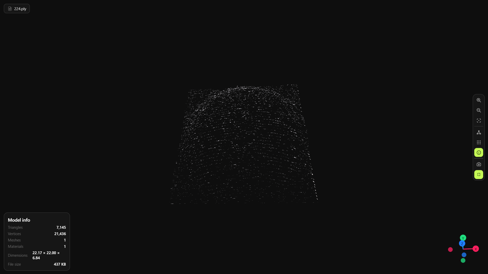
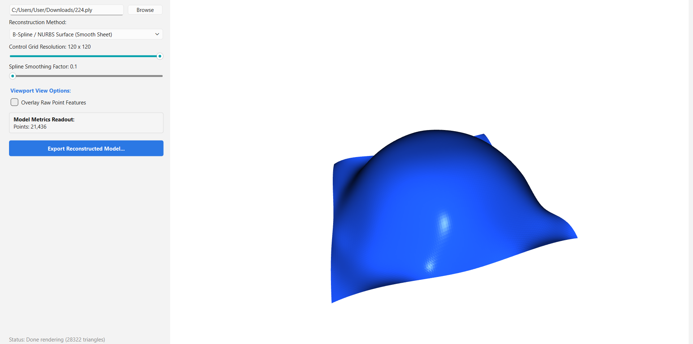
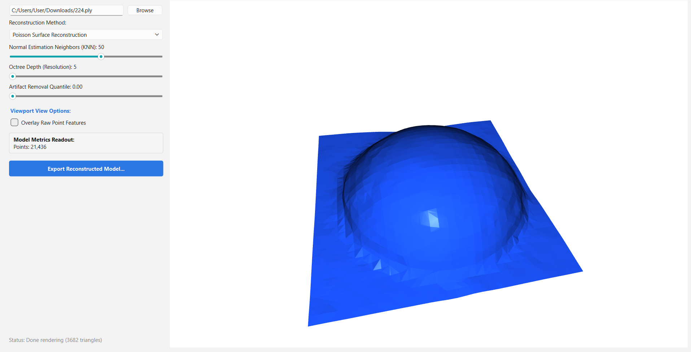

# 🧊 3D Surface Reconstructor Dashboard

An interactive PyQt6-based desktop application for real-time 3D surface reconstruction. This tool transforms raw, noisy point cloud data into clean, usable 3D meshes using industry-standard algorithms.

## 🖼️ Visual Results (Before & After)

Visualizing the reconstruction process is key to understanding how these algorithms work. Below is an example of a raw point cloud being transformed into a solid surface.

### 1. The Input: Raw Point Cloud
This is the starting point—a collection of thousands of individual points in 3D space, captured by a laser sensor in a CNC machine.


### 2. The Output: Reconstructed Surface
The dashboard applies advanced math to "connect the dots" and create a continuous, smooth 3D mesh ready for 3D printing or CAD modeling.
 


---

## 🧠 Why Multiple Algorithms?

Not all 3D shapes are the same, so we provide four different reconstruction methods to suit any user's needs:

| Algorithm | Best For... | Key Advantage |
|-----------|-------------|---------------|
| **Poisson Reconstruction** | Watertight, smooth surfaces | Highly robust to noise; creates closed "solid" models. |
| **Ball Pivoting (BPA)** | Preserving fine details | Keeps the original points exactly where they are; great for mechanical parts. |
| **B-Spline / NURBS** | Mathematical smoothness | Creates organic, ultra-smooth sheets; perfect for curved surfaces. |
| **Polynomial Fitting** | Simple geometric shapes | Fast and efficient for flat or slightly curved surfaces. |

---

## ✨ Key Features

*   **Real-Time Parameter Tweaking**: Adjust Octree Depth, Ball Radius, or Smoothing factors and see the mesh update instantly.
*   **Live 3D Viewport**: Full 360° rotation and zoom using the integrated Open3D renderer.
*   **Professional Export**: Save your final work as OBJ, STL, or STEP for use in other professional software.

## 🚀 Technologies Used

*   **Python & PyQt6**: For a responsive, modern desktop experience.
*   **Open3D**: The powerhouse behind the 3D processing and visualization.
*   **NumPy & SciPy**: For the heavy-duty mathematical calculations.

## ⚙️ Setup and Installation

1.  **Clone and Enter**:
    ```bash
    git clone [repository_url]
    cd 3d-surface-reconstructor
    ```
2.  **Install Requirements**:
    ```bash
    pip install -r requirements.txt
    ```
3.  **Run**:
    ```bash
    python maincode.py
    ```

## 📁 Project Structure

```
3d-surface-reconstructor/
├── maincode.py               # Main application logic
├── assets/                   # Store your screenshots here!
├── requirements.txt          # Dependencies
└── README.md                 # Project documentation

```
## 📄 Full Documentation
A comprehensive technical report detailing the mathematical background and performance benchmarks is currently in progress and will be added to the /docs folder soon.


